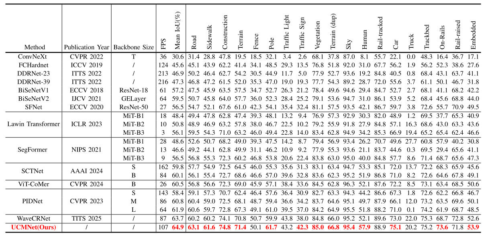
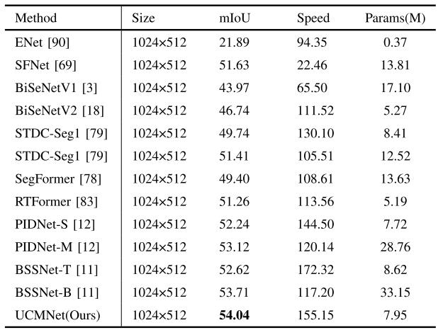
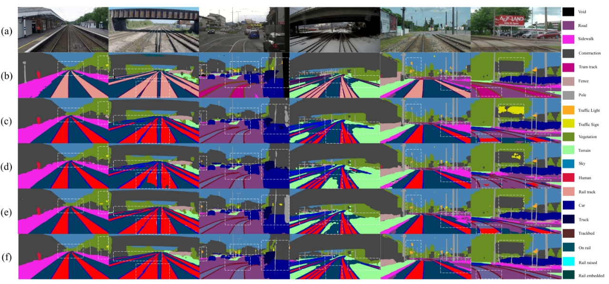
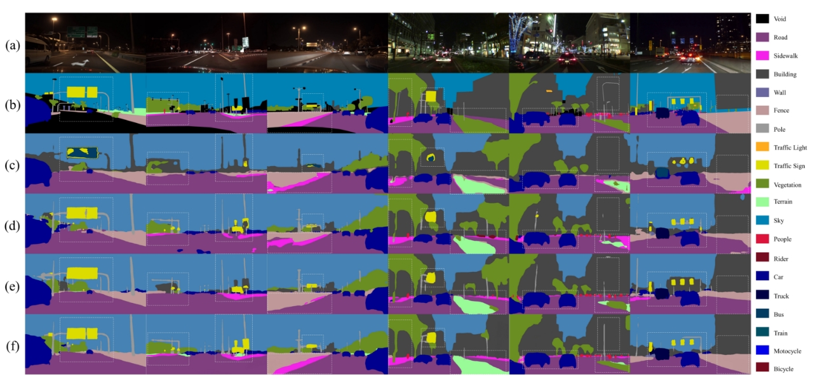
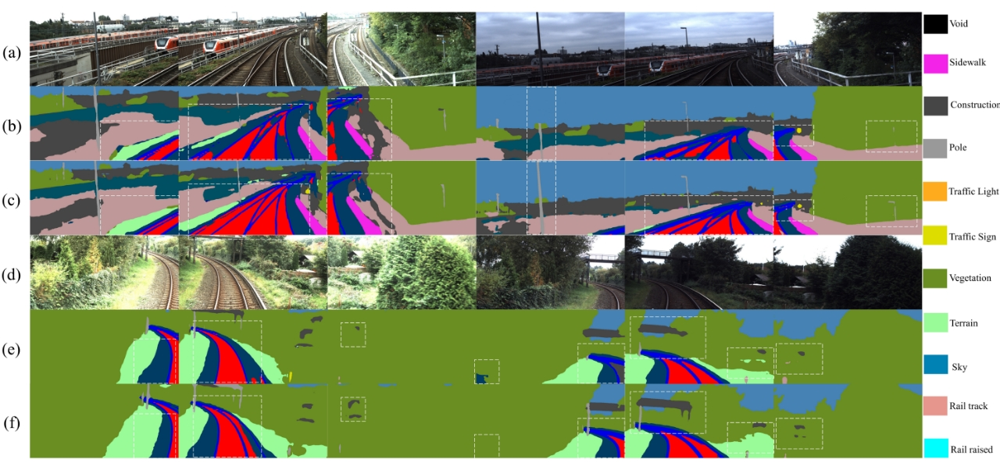

# UCMNet: Robust Semantic Segmentation for Autonomous Train Environmental Monitoring and Geometric Measurements in Adverse Scenes

This repository contains the official Pytorch implementation of training & evaluation code for UCMNet🔥

We are committed to achieving the first fully public project for real-time semantic segmentation of railway scenes🔥

Authors : Lu Yang, Xinyi Wang, Yiwen Bai*, Xiaoxi Hu, Chongke Bi, and Ronghui Zhang 

Institutions : Tianjin University of Technology, Beihang University, Beijing Jiaotong University, Tianjin University, and Sun Yat-sen University

## Introduction
<p align="center">
  </br>
  <span align="center">Comprehensive performance review of speed, accuracy, and parameters for real-time semantic segmentation methods of railway scenes on the RailSem19 test set. The diameter size of the dot indicates the scale of parameters. The red dots indicate our method, and the blue dots indicate other state-of-the-art methods. Our proposed UCMNet achieves a better trade-off between accuracy and inference speed with lower computation complexity.</span> 
</p>


* **Boundary calibration branch**:  Given the significant changes in background uncertainty caused by the rapid train movement in railway scenes, the boundary branch with boundary calibration module is introduced to distinguish highly similar target objects. Through cross-dimensional feature interaction and learnable sampling of multiple groups sub-features, the boundary calibration module can achieve secondary calibration of the boundary features of the target objects. Meantime, given almost all the existing pyramid pooling modules only achieve homogeneous context encoding with various pooling and convolution, the context-specific module capable of achieving pixel-by-pixel differentiated context encoding for multi-scale target objects is proposed.
* **Manhattan self-attention**:  Inspired by the recent success of RetNet in the NLP field, we introduce the explicit spatial prior and Manhattan selfattention to the semantic segmentation of railway scenes for the first time. The problem that traditional attention mechanisms are unaware of complex long-distance relationships is solved to some extent by the Manhattan prior module. Self-attention is decomposed along the two dimensions of height and width under the idea of Manhattan distance. Not only is the explicit spatial prior preserved, but the pixel-by-pixel spatial positional calculation is also achieved with low computation complexity.
* **Uncertainty-aware training strategy**: Given that most existing training strategies for semantic segmentation of railway scenes are rooted in semantic segmentation of urban scenes, the uncertaintyaware training strategy is proposed for the first time with the basis of the deep supervision and boundary guidance mechanism. By introducing uncertainty-aware cross-entropy loss and dynamic MCDropout sampling, this strategy effectively alleviates the problem of severe performance degradation of semantic segmentation in railway scenes.


## Overview
<p align="center">
  </br>
  <span align="center">The detail structure of UCMNet. </span> 
</p>


## Datasets

* Download the [RailSem19](http://www.wilddash.cc) and [NightCity](https://dmcv.sjtu.edu.cn/people/phd/tanxin/NightCity/index.html) datasets and unzip them in `data/railsem19` and `data/nightcity` dirs.
* Check if the paths contained in lists of `data/list` are correct for dataset images.


## Training
* Download the ImageNet pretrained models and put them into `pretrained_models/imagenet/` dir.
* For example, train the UCMNet on RailSem19 with batch size of 4 on a single GPU(recommend):
````bash
python tools/train.py --cfg configs/railsem19/ucmnet_railsem19.yaml GPUS (0,) TRAIN.BATCH_SIZE_PER_GPU 4
````
* Or train the UCMNet on NightCity with batch size of 4 on a single GPU(recommend):
````bash
python tools/train.py --cfg configs/nightcity/ucmnet_nightcity.yaml GPUS (0,) TRAIN.BATCH_SIZE_PER_GPU 4
````


## Evaluation
* Download the finetuned models for RailSem19 and NightCity and put them into `pretrained_models/railsem19/` and `pretrained_models/nightcity/` dirs, respectively.
* For example, evaluate the UCMNet on RailSem19 dataset:
````bash
python tools/eval.py --cfg configs/railsem19/ucmnet_railsem19.yaml \
                          TEST.MODEL_FILE pretrained_models/railsem19/UCMNet_RailSem19.pt
````
* Or, evaluate the UCMNet on NightCity dataset:
````bash
python tools/eval.py --cfg configs/nightcity/ucmnet_nightcity.yaml \
                          TEST.MODEL_FILE pretrained_models/nightcity/UCMNet_NightCity.pt
````


## Results on RailSem19 and NightCity

### RailSem19
<p align="center">
  </br>
  <span align="center"> Class-wise accuracy comparison of the recent state-of-the-art methods on the RailSem19 test set.</span>
</p>


### NightCity
<p align="center">
  </br>
  <span align="center"> Comprehensive performance comparison with state-of-the-art semantic segmentation networks on the NightCity dataset.</span>
</p>


## Visualizations

The visualization results of UCMNet on the RailSem19, NightCity, and OsDaR23 datasets are shown. It can be seen that the LCFNets do a very good job of segmenting objects in the categories of cars, bicycles, roads, sky, etc. The boundary contours of small target objects such as traffic lights and poles are also clearly shown by LCFNets. This justifies the introduction of compensation branch to improve segmentation accuracy.
<p align="center">
  </br>
  <span align="center"> Result visualization comparison of the segmentation results of UCMNet and several recent state-of-the-art methods on the RailSem19 test set.</span>
</p>

<p align="center">
  </br>
  <span align="center">Result visualization comparison of the segmentation results of UCMNet and several recent state-of-the-art methods on the NightCity val set.</span>
</p>

<p align="center">
  </br>
  <span align="center">Result visualization comparison of the segmentation results of UCMNet and BiSeNetV2 on the OsDaR23 val set.</span>
</p>


## Citation

If you think this implementation is useful for your work, please cite our paper:
```
@article{wang2025ucmnet,
  title={UCMNet: Uncertainty-Aware and Context-Specific Network with Manhattan Prior for Real-Time Semantic Segmentation of Railway Scenes},
  author={Lu Yang, Xinyi Wang, Yiwen Bai*, Xiaoxi Hu, Chongke Bi, and Ronghui Zhang},
  year={2025}
}
```


## Acknowledgement

* Our implementation is modified based on [LCFNet-Semantic-Segmentation](https://github.com/yiwen-bai/LCFNets), [PIDNet-Semantic-Segmentation](https://github.com/XuJiacong/PIDNet), and [HRNet-Semantic-Segmentation](https://github.com/HRNet/HRNet-Semantic-Segmentation).
* Thanks for their nice contribution.

